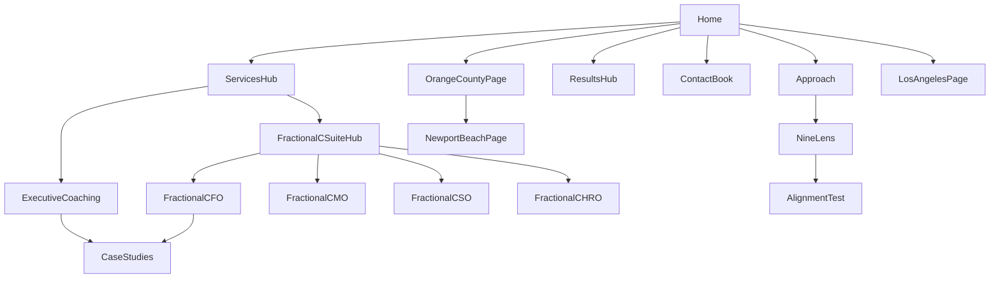

# KLE renewed site content + sitemap plan

## Goals and constraints (locked from you)
- **Primary conversion:** book a consultation / discovery call.
- **SEO geography:** **Orange County / Los Angeles** emphasis (service-area + Newport Beach HQ credibility), without turning the brand into a “cheap local coach” listing site.

## Positioning spine (what every page should prove)
Use interview-backed differentiators as the through-line (not acronyms-first):
- **Candour + alignment:** neutral third party; elephant-in-the-room; constructive critique that changes behaviour.
- **Execution, not decks:** bespoke recommendations after listening; work alongside leadership; measurable operational moves in weeks, not quarters.
- **Leadership elevation + team quality:** operational-to-strategic shift; delegation; confidence; “A-player bar” where relevant.

Competitor doc implication: lead with **outcomes + proof density above the fold**, keep frameworks **visual + scannable**, and avoid “text-heavy guru” presentation.

## Recommended information architecture (MVP sitemap)

### Global / utility
- `/` — **Home** (pipeline router + proof + 3 pathways)
- `/contact` — **Contact / book** (calendar-first; phone + address; what to expect)
- `/privacy-policy` — **Privacy**
- `/terms` — **Terms** (only if you collect leads / use scheduling tools)

### Trust + conversion
- `/results` — **Results hub** (quantified outcomes, logos, short case snapshots; link out to deeper stories)
- `/case-studies/` — **Case studies index**
- `/case-studies/[slug]` — **3–6 flagship stories** (start with the strongest narratives from interviews: crisis scaling, owner-to-corporate transition, team rebuild)
- `/testimonials` — **Testimonials library** (filterable by role/industry if easy; otherwise grouped sections)

### Method (keep it practical, not jargon-forward)
- `/approach` — **How we work** (engagement shape, cadence, stakeholder design, what week 0–12 looks like)
- `/eq-execution` — **EQ + Execution** (plain-language explanation + where it shows up in work)
- `/9lens` — **9Lens framework** (interactive/static diagram + “when this shows up in your org” scenarios)
- `/alignment-test` — **9Lens alignment test** (can be embedded Tally/Typeform; still a crawlable landing page with context + FAQs)

### Services (commercial SEO + sales enablement)
- `/services` — **Services hub** (three pathways + comparison table)
- `/services/executive-coaching` — **Executive + leadership team coaching**
- `/services/fractional-c-suite` — **Fractional C-suite hub**
  - `/services/fractional-cfo`
  - `/services/fractional-cmo`
  - `/services/fractional-cso`
  - `/services/fractional-chro`
- `/services/strategy-facilitation` — **Strategy steering + facilitation**
- `/services/speaking-retreats` — **Keynotes + retreats + workshops**
- `/services/customer-journey-brand` — **Customer journey + brand clarity** (only if this is a real revenue line; otherwise merge into `/services/strategy-facilitation`)

### People + credibility
- `/team` — **Team** (bios, credentials, how engagements are staffed)
- `/amit-kothari` — **Founder page** (deep E-E-A-T: background, philosophy, select media, speaking)

### Local SEO layer (OC/LA, restrained)
- `/locations/newport-beach-executive-coaching` — **HQ credibility page** (map, who you serve, industries, FAQs, booking CTA)
- `/locations/orange-county-executive-coaching` — **OC umbrella** (suburbs served, typical engagements, internal links to services)
- `/locations/los-angeles-executive-coaching` — **LA umbrella** (virtual + onsite cadence, travel expectations)

### Optional phase 2 (only if you will maintain it)
- `/insights/` — **Insights hub** (monthly cadence minimum)
- `/insights/[topic-slug]` — **Pillar posts** targeting high-intent questions (e.g., fractional CFO for scaling family businesses; CEO coaching during integration)

## Internal linking model (simple, high leverage)

## Page-by-page content blueprint (what each URL must accomplish)

### Home (`/`)
- **Above the fold:** one outcome-led headline + subhead + primary CTA (book) + secondary CTA (alignment test) + **logo strip** + **3 proof stats** (promotions arc, 90-day speed, “ideas + action” quote).
- **Pathways:** three cards linking to `/services/executive-coaching`, `/services/fractional-c-suite`, `/services/strategy-facilitation`.
- **Proof section:** 2 short case “teasers” linking to `/case-studies/...`.
- **Objection handling (light):** pricing framed as investment + what “right-sized” looks like (addresses interview friction without being defensive).

### Services hub (`/services`)
- **Chooser UX:** “If you’re dealing with X, start here” mapping to child pages.
- **Engagement snapshot:** typical cadence, stakeholders, what changes first.

### Executive coaching (`/services/executive-coaching`)
- **Who it’s for:** CEOs/presidents + leadership teams in transition.
- **Outcomes:** delegation, decision quality, conflict reduction, team confidence.
- **Proof:** testimonials + case links + methodology in plain English.

### Fractional hub + role pages
- **Hub page:** when fractional makes sense vs coaching; how governance works with an existing COO/CFO (addresses “threat to role” risk carefully).
- **Role pages:** specific problems solved, first 30 days, example deliverables, who should not buy.

### Approach (`/approach`)
- **Process transparency:** listen-first, diagnostic, execution cycles, reporting cadence.
- **Billing clarity:** what good looks like (without publishing rates unless you choose to): scopes, milestones, meeting cadence, async support boundaries.

### Results + case studies
- **Case study template (repeatable):** situation → tension → intervention → actions → measurable outcomes → “what it felt like” client quote → CTA.
- **Prominence:** place strongest proof on pages that compete commercially (fractional + coaching).

### Location pages (OC/LA)
- **Intent:** capture “near me” variants without diluting premium positioning.
- **Must-include:** service area statement, industries served, booking CTA, FAQs, internal links to top services.

## SEO/IA hygiene (paired with the sitemap)
- Publish **`robots.txt`** with `Sitemap:` directive and ensure **`/sitemap.xml`** exists (your earlier audit flagged missing/empty signals).
- Ensure nav destinations match **real crawlable URLs** (avoid “sections only” if you want SEO pages to rank).
- **Canonical + indexation:** one URL per concept; avoid duplicating long homepage blocks on other URLs.

## Schema note (validation step, not guesswork)
- Validate JSON-LD in-browser or Rich Results Test (fetch-based audits can miss JS-injected schema).

## Deliverables I will produce after you confirm this plan
- A **written sitemap table** (URL, primary keyword intent, H1, meta title/description pattern, internal links in/out).
- **Homepage + 6 priority page outlines** (H1/H2s, sections, CTA placement) aligned to “book call” + OC/LA.
- A **case study interview questionnaire** to turn existing client stories into repeatable `/case-studies/*` assets.
